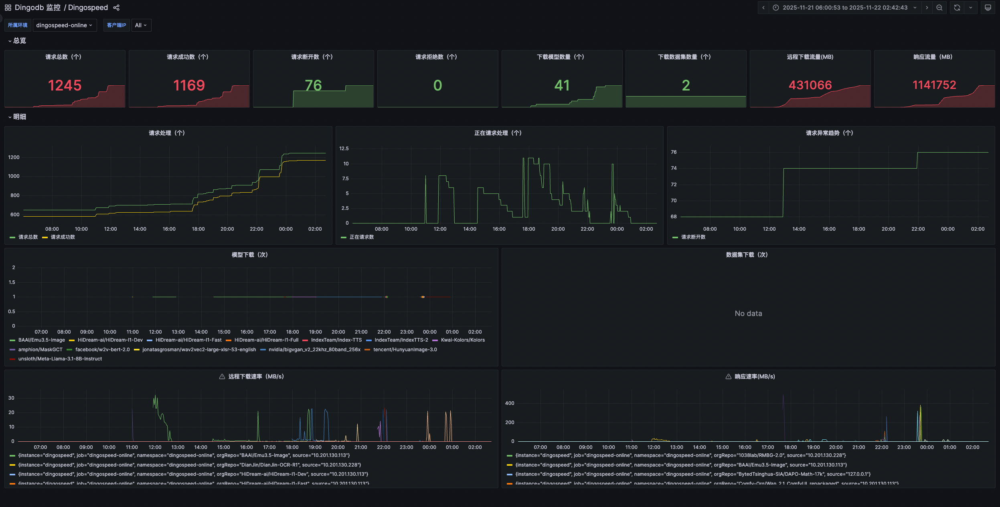
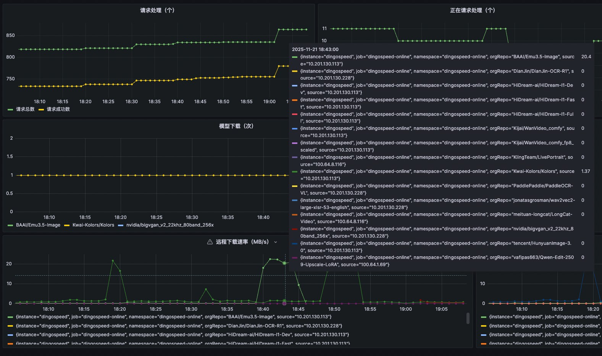
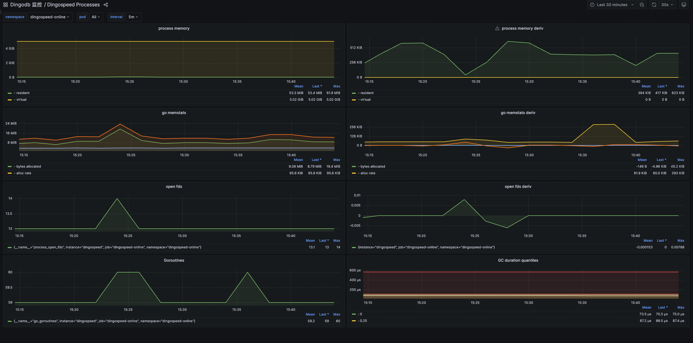

# DingoSpeed
English | [简体中文](README-zh_CN.md)

DingoSpeed is a self-hosted Hugging Face mirror service designed to provide users with a convenient and efficient solution for accessing and managing model resources. Through local mirroring, users can reduce their reliance on remote Hugging Face servers, improve resource acquisition speed, and achieve local storage and management of data.

# Product Features
DingoSpeed has the following main product features:
* Mirror Acceleration: Cache the resources downloaded for the first time. When the client makes a subsequent request, the data will be read from the cache and returned, greatly improving the download rate.
* Convenient Access: There is no need for scientific internet access or complex network configuration. Simply deploy the DingoSpeed service and use it as the proxy address to easily complete the download.
* Traffic Reduction and Load Alleviation: Download once and use multiple times, reducing the traffic waste caused by repeated downloads, which is efficient and saves traffic.
* Localized Management: Cover the entire process of local compilation, deployment, monitoring, and usage of the mirror service, bringing an excellent and flexible experience. It avoids reliance on external networks and public mirror repositories, significantly improving the system's response speed and data security.

# Function List
## Single node download
1. [x] implements HTTP RESTful API (compatible with HF Hub specification), supports model and dataset download;
2. [x] supports online and offline download mode, will give priority to check whether the model has been updated, and give priority to return the content downloaded locally;
3. [x] Support HTTP Range request, realize the client break point continuation, the server downloads large files in blocks, reduce memory occupation;
4. [x] Support download line automatic switching (huggingface.co->hf-mirror.com), automatically enable proxy connection;
5. [x] Implement multi-version snapshot storage.
6. [x] Support large file block storage and multi-copy storage nodes;
7. [x] Low memory usage, stable download speed;
## Multi-node collaborative download
1. [x] Support synchronous caching data across multiple DingoSpeed mirror nodes to avoid multiple nodes downloading the same file repeatedly;
2. [x] Support intelligent scheduling among multiple DingoSpeed mirror nodes, return the best download node, and build a peer-to-peer download network;
3. [x] Support model and dataset warm-up download, real-time display of the overall download rate, progress, etc.
4. [x] Support caching hot models and datasets to public directories for easy mounting into containers;
5. [x] Support failover, if the access to other Dingospeed node fails, it will be back to the source download;
## Operational Monitoring
1. [x] Support real-time monitoring of download IP, download speed, traffic size (MB), request status, and download content (which model or dataset);
2. [x] implements a variety of disk cleaning strategies (LRU/FIFO/LARGE_FIRST), timing tasks, threshold triggering;
3. [x] Real-time detection of download status, if the network is abnormal, the enterprise and micro alarm will be triggered;


# System Architecture
## Single-node system architecture


## Multi-node collaborative system architecture diagram


# Installation
The project uses the wire command to generate the required dependency code. Install the wire command as follows：
```bash
# Import into the project
go get -u github.com/google/wire

# Install the command
go install github.com/google/wire/cmd/wire
```

Wire is a flexible dependency injection tool that completes dependency injection at compile time by automatically generating code. In the dependency relationships between various components, explicit initialization is usually used instead of passing global variables. Therefore, using Wire to initialize the code can effectively solve the coupling between components and improve code maintainability.
> This project uses go mod to manage dependencies and requires Go version 1.23 or higher. It uses makefile to manage the project and requires the make command.

```bash
# 1. Install dependencies
make init

# 2. Generate code
make wire

# 3. Compile the executable file for the current system version
make build

# 4. Compile the Linux executable file on macOS
make macbuild

# 5. Add a license to each file
make license

```
# Quick Start
Deploy the compiled binary file and execute ./dingospeed to start the service. Then set the environment variable HF_ENDPOINT to the mirror site (here it is http://localhost:8090/).

Linux:
```shell
export HF_ENDPOINT=http://localhost:8090
```
Windows Powershell:
```shell
$env:HF_ENDPOINT = "http://localhost:8090"
```
From now on, all download operations in the Hugging Face library will be proxied through this mirror site. You can install the Python library to try it out:

```shell
pip install -U huggingface_hub
```
```shell
from huggingface_hub import snapshot_download

snapshot_download(repo_id='Qwen/Qwen-7B', repo_type='model',
local_dir='./model_dir', resume_download=True,
max_workers=8)

```
Alternatively, you can use the Hugging Face CLI to directly download models and datasets.
Download GPT2:
```shell
huggingface-cli download --resume-download openai-community/gpt2 --local-dir gpt2
```
Download a single file:

```shell
huggingface-cli download --resume-download --force-download  HuggingFaceTB/SmolVLM-256M-Instruct config.json
```
Download WikiText:
```shell
huggingface-cli download --repo-type dataset --resume-download Salesforce/wikitext --local-dir wikitext
```
You can view the path ./repos, where the caches of all datasets and models are stored.

# Downloading Models
The file is divided into different segments of a certain size. The scheduling tool submits the tasks to the coroutine pool for execution. Each coroutine task submits the assigned length to the remote server for a request, reads the response results in chunks, and caches the results in the coroutine's exclusive work queue. The push coroutine then pushes the data to the client. At the same time, it checks whether the current chunk meets the size of a block. If it does, the block is written to the file.


# Storing Models

The repository cache data file consists of a HEADER and data blocks. The functions of the HEADER are as follows:
1. Improve the readability of the cache file. Even if the configuration file is modified or the program is upgraded, it will not affect the reading of the cached file.
2. Efficiently check the existence of blocks without reading the actual database, improving operation efficiency.


# Ops monitoring
When using Dingospeed, you need to monitor the current running status in real time, such as when you download, which models to download, how fast to download, and download IP, etc. Dingospeed has integrated prometheus to collect running data, and shows the running status in real time through grafana. grafana is configured in config/grafana.






# Get in touch and join the community
